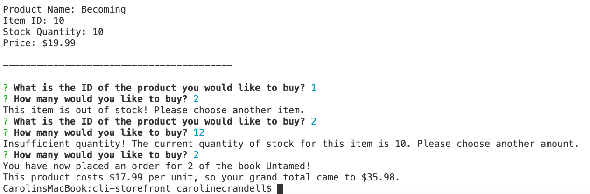

## Command Line Storefront


**What does this application do and why?**

* This command line application operates like a Amazon-like storefront. 
* When the application begins, the console displays the stock inventory and prompts the user to input the ID of the item they wish to purchase.
* After the user inputs the ID of the item, they are prompted to input how many of this item they wish to purchase.
* If the desired item is out of stock, the user is prompted to choose another item ID.
* If there is low stock of the desired item, the user is prompted to specify a different quantity.
* If there is enough stock to meet the user's needs, the order is placed and the desired quantity is subtracted from the item inventory, thus updating the database.

**How the application is organized**

This application is organized into the following files: 

* *index.js* - this contains the functions to perform based on command line input.

* *storefront.sql* - this contains the construction of the database of stock.

* *package.json* - this contains the information of what npm packages to install. 

* Upon installation, a folder named "node_modules" and a file called "package-lock.json" will appear, detailing which modules have been downloaded into the root folder.

* *README* - this file contains all information about this application.

* *images folder* - stores the media files for this README file.

**Step-by-Step on how to run the application**

When you clone this application repository to your computer, go into the root folder in your terminal and type:
```js
npm install
```
After installation, type in the terminal: 
```js
node index.js
```
Then the console will show the list of products, their IDs, the quantity of stock, and their prices, like so:


Then the user is asked to input the ID of the item they wish to purchase and how many of this item they wish to purchase, like so:


If the desired item is out of stock, the application will prompt the user to choose another item ID, like so:


If there is low stock of the desired item, the application prompts the user to specify a different quantity, like so:


If there is enough stock to meet the user's needs, the order is placed and the user is shown how much they spent, like so:



**Technologies Used** 

* Node.js
* Javascript
* npm
* package.json
* inquirer
* mysql
* MAMP
* mySQL Workbench
* SQL

**My Role**

All files are written by cecrandell.